<p align="center">
  
</p>

<h1 align="center">Meridian</h1>

<p align="center">
  <b>The operating system for creator-driven growth.</b><br/>
  A decision engine that turns a product, a budget, and a revenue goal into the exact creators who will hit it.
</p>

<p align="center">
  
  
  
  
  
  
</p>

---

Meridian is not an influencer marketplace. It is the intelligence layer that decides **which creators generate revenue**, forecasts the return **before** a rupee is spent, and measures what actually happened afterward. Brands stop asking _"which influencer should I hire?"_ and start asking _"I need this much revenue next quarter, how?"_

<p align="center">
  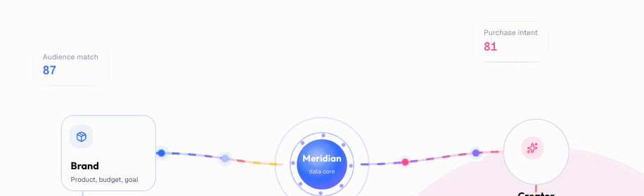
</p>

<p align="center"><i>Brand &rarr; Meridian data core &rarr; creator &rarr; attributed revenue. Every connection backed by data.</i></p>

---

## Highlights

- **AI command console.** Describe a product, budget, and goal in one sentence. An LLM tool-use loop runs the engines and returns a ranked lineup, budget allocation, and a revenue forecast.
- **Five intelligence engines.** Recommendation, prediction, budget planning, attribution, and trend scoring, all reading from one creator graph.
- **Real creator profiles.** Creators are real public figures linked by their genuine Instagram and YouTube handles, with live profile avatars.
- **The data flywheel.** Every completed campaign feeds realized ROAS back into the rankings, so each forecast is sharper than the last.
- **A landing experience to match.** Motion-rich marketing site with an animated brand-to-revenue flow and an interactive WebGL creator graph.

---

## Demo and screenshots

### The console: a brief becomes a plan
<p align="center">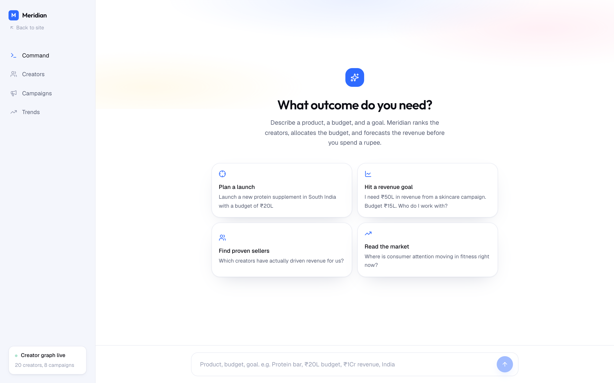</p>

### Creator intelligence and real social profiles
<table>
  <tr>
    <td width="50%">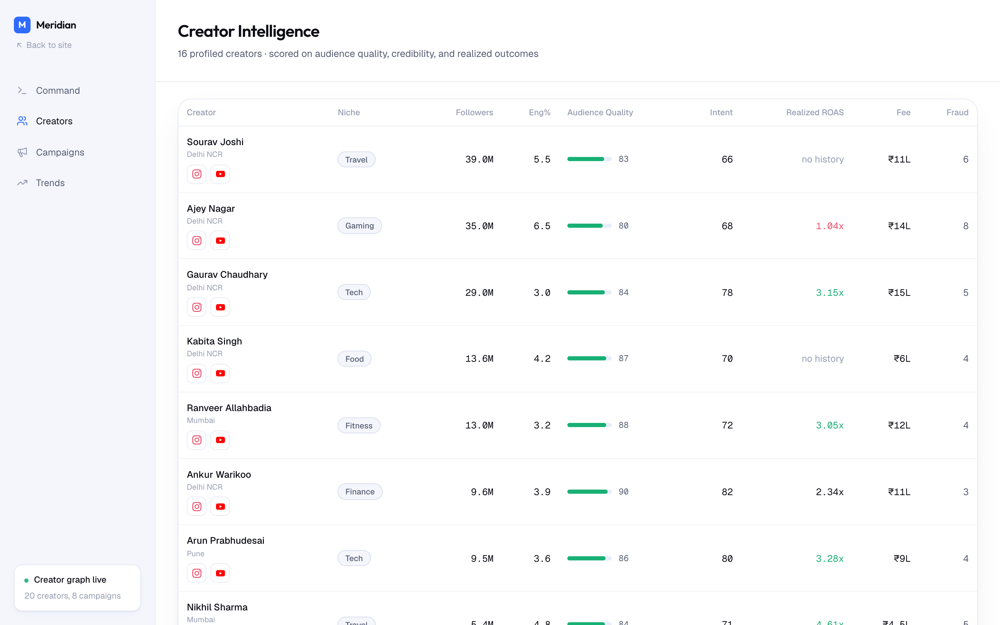</td>
    <td width="50%">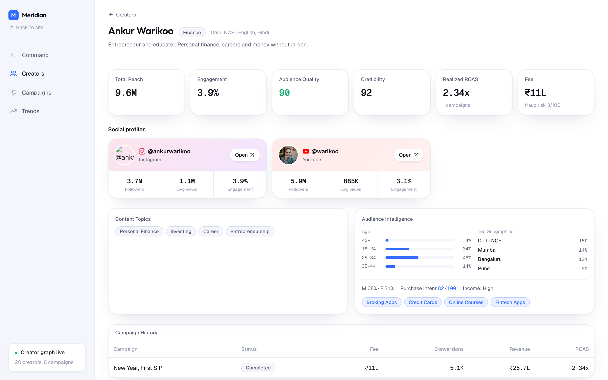</td>
  </tr>
</table>

### Campaign attribution and trend radar
<table>
  <tr>
    <td width="50%">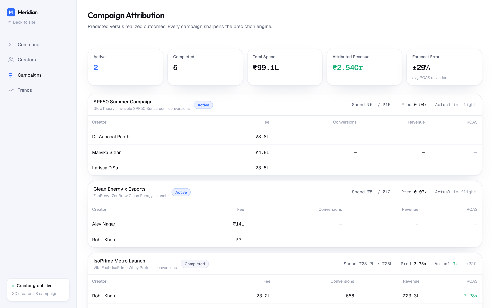</td>
    <td width="50%">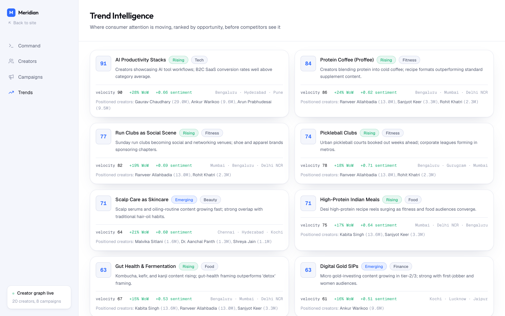</td>
  </tr>
</table>

### Landing: connection flow and the WebGL creator graph
<table>
  <tr>
    <td width="50%">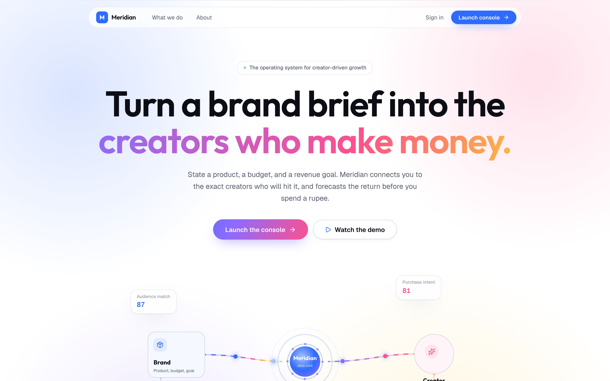</td>
    <td width="50%">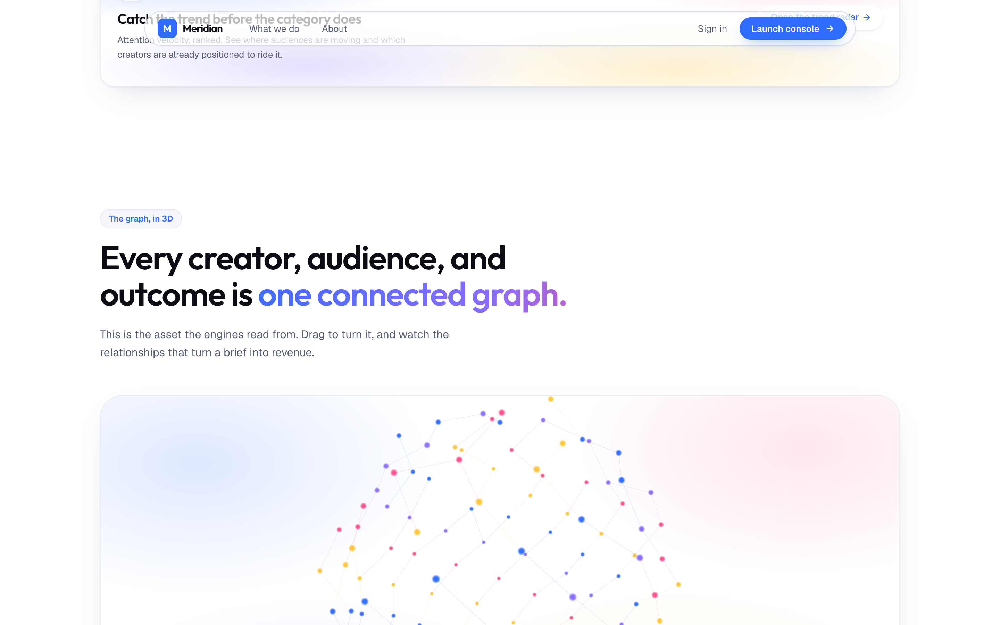</td>
  </tr>
</table>

---

## The intelligence layer

The moat is not the UI. It is the engines underneath it.

| Engine | What it does | Output |
| --- | --- | --- |
| **Recommendation** | Scores creators on category fit, audience fit, realized performance, fraud-adjusted quality, and value. | Ranked creators with match and confidence scores |
| **Prediction** | Forecasts the funnel: reach, clicks, conversions, revenue, ROAS. | Outcome forecast with confidence bands |
| **Planner** | Allocates a budget across creators against a revenue goal, with diversification limits. | Lineup, allocation, goal coverage, risks |
| **Attribution** | Connects creator activity to realized outcomes, predicted vs actual. | Per-creator track records, forecast accuracy |
| **Trends** | Ranks where consumer attention is accelerating and who is positioned to ride it. | Opportunity-scored trends |

---

## Architecture

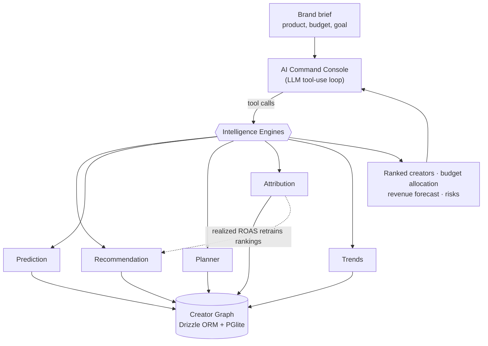

### The data flywheel

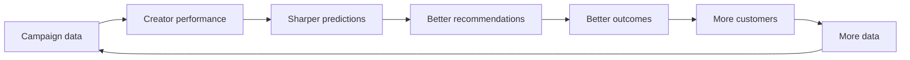

Each turn of the loop widens the gap a competitor starting today would have to close.

---

## Tech stack

| Layer | Choice |
| --- | --- |
| Framework | Next.js 16 (App Router, RSC), React 19 |
| Language | TypeScript |
| Styling | Tailwind CSS v4, custom design tokens |
| Data | Drizzle ORM over PGlite (embedded Postgres, zero setup) |
| AI console | Groq (OpenAI-compatible) tool-use loop, free tier |
| Motion | Motion (`motion/react`) and GSAP |
| 3D | Three.js (WebGL creator graph) |

---

## Getting started

```bash
# 1. Install
npm install

# 2. Run
npm run dev
```

Open [http://localhost:3000](http://localhost:3000). The embedded database creates and seeds itself on first request, no external services required. Delete the `.pglite/` folder to reset to seed data.

The **AI console** needs a free [Groq](https://console.groq.com) API key:

```bash
echo 'GROQ_API_KEY=gsk_...' > .env.local
```

It uses Groq's OpenAI-compatible API with `llama-3.3-70b-versatile` by default (override with `GROQ_MODEL`).

Without a key, the Creators, Campaigns, and Trends pages still work fully, they query the engines directly.

### Try in the console

> Launch a new protein supplement in South India with a budget of ₹20L

> I need ₹50L in revenue from a skincare campaign. Budget ₹15L. Who do I work with?

> Where is consumer attention moving in fitness right now?

---

## Project structure

```
src/
├─ app/
│  ├─ (marketing)/        Landing, About, What we do
│  ├─ (app)/              Console, Creators, Campaigns, Trends
│  └─ api/chat/           AI tool-use endpoint
├─ components/
│  ├─ marketing/          Hero, connection flow, 3D graph, pipeline, bento
│  └─ ...                 Console, artifacts, social previews, primitives
└─ lib/
   ├─ db/                 Drizzle schema, PGlite client, seed
   ├─ engines/            recommendation, prediction, planner, attribution, trends
   └─ ai/                 engines exposed as LLM tools
```

---

## How a brief becomes a plan

1. **The brand states a goal.** Product, budget, geography, and the revenue it needs.
2. **The data scores the graph.** Audience quality, purchase intent, and realized outcomes per creator.
3. **The engines match and forecast.** The creators who maximize expected outcome, ranked with confidence.
4. **Revenue is attributed back.** Realized results feed the flywheel and sharpen the next forecast.

---

<p align="center"><sub>Built as a decision engine for creator-driven growth. Not a marketplace.</sub></p>
